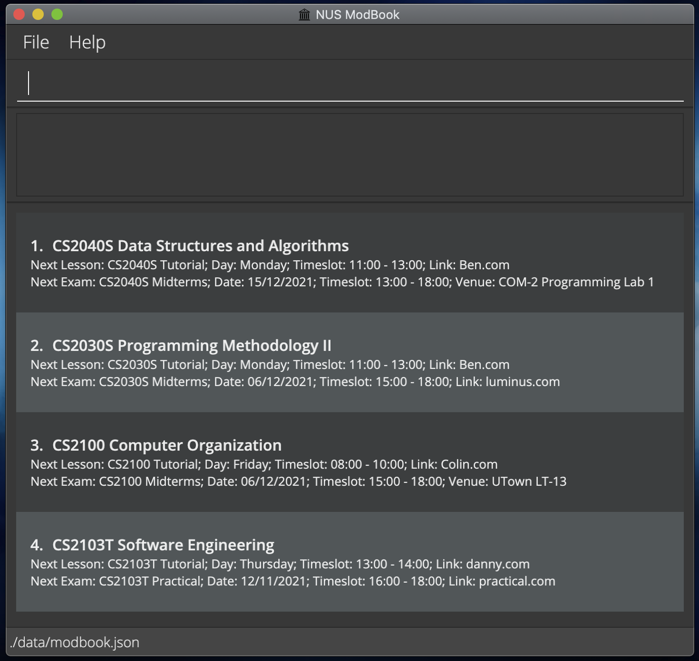

NUS ModBook
===========

NUS ModBook is a **desktop app for managing modules, optimized for use via a Command Line Interface** (CLI) while still having the benefits of a Graphical User Interface (GUI). If you can type fast, ModBook can help you organise modules faster than traditional GUI apps.

Check out our [project website](https://ay2122s1-cs2103t-t13-1.github.io/tp/) to find out more!
